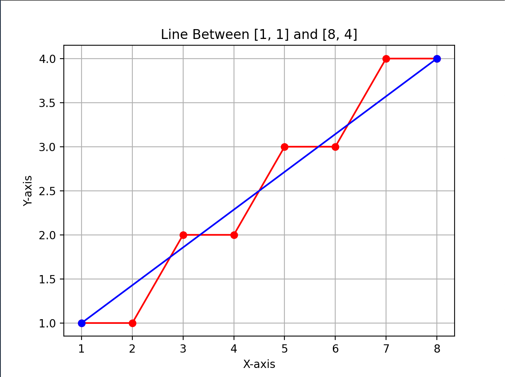

# Computer Graphics Assignments 
## Bresenham's Line Algorithm Implementation in Python

This Python code implements the **Bresenham's Line Drawing Algorithm**, a popular technique for drawing lines on digital displays. It uses integer arithmetic and decision parameters to ensure accurate line representation even on pixelated screens.

**Key Features:**

* Clear and concise implementation with separate functions for different slopes.
* Visual representation using `matplotlib` for easy understanding.
* Handles lines with various slopes (less than and greater than one).
* Includes predefined test cases for demonstration.

## Outputs
The algorithm was tested with the following cases:

- **Overall Output**: 

- **Case 1**: Line from (1,1) to (8,4) - Represents a slope where 0 < m < 1.

- **Case 2**: Line from (1,1) to (4,8) - Represents a slope where m > 1.

## Adjustments for Slope m > 1

For lines with slopes greater than 1, the algorithm makes the following adjustments:

* **Swapping Coordinates:** The X and Y coordinates of the input points are swapped. This effectively treats the steeper line as a shallow line with its original slope inverted (1/m).
* **Decision Parameter Modification:** The best case for decision parameter (`p`) is adjusted to
`p_new = 2 * dx - dy` to account for the swapped coordinates and inverted slope and for general case, decision parameter (`p`) is adjusted to `p_new = p + 2 * dx - 2 * dy`

These adjustments ensure accurate calculation of intermediate points for lines with any slope, maintaining the efficiency and clarity of the original algorithm.

**Getting Started:**

1. Clone the git repository with `git clone https://github.com/SaYMy-NaMe/Computer-Graphics-Assignments.git`
2. Install `matplotlib` with `pip3 install matplotlib`, or comment the `visual_show` function definition and the calls. (In this case, You won't be able to see the visuals)
3. Run the code (no arguments) to see the test cases.
4. Uncomment the `inputCoordinates` (comment the predefined test cases) function and `n` variable in `main` for user input.

## Author

* Ashrafur Rahman Chowdhury (Reg: 2019831070 | SWE - IICT | SUST)
* Contact: ashrafur035@gmail.com | +880 1798262185
